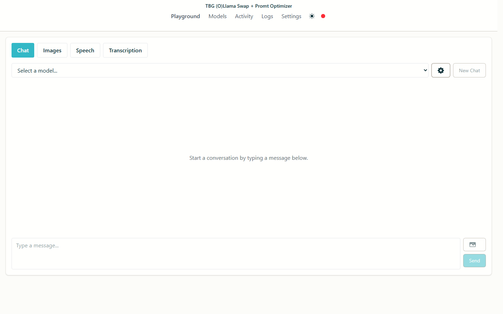
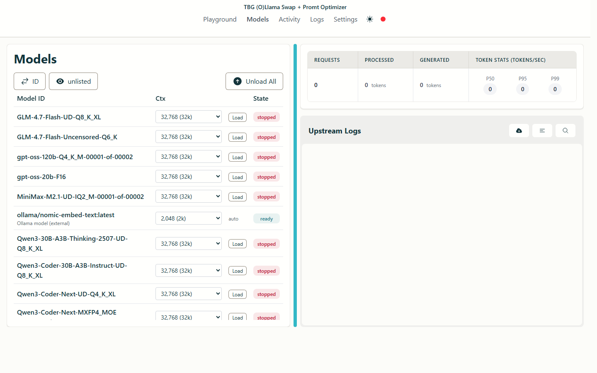
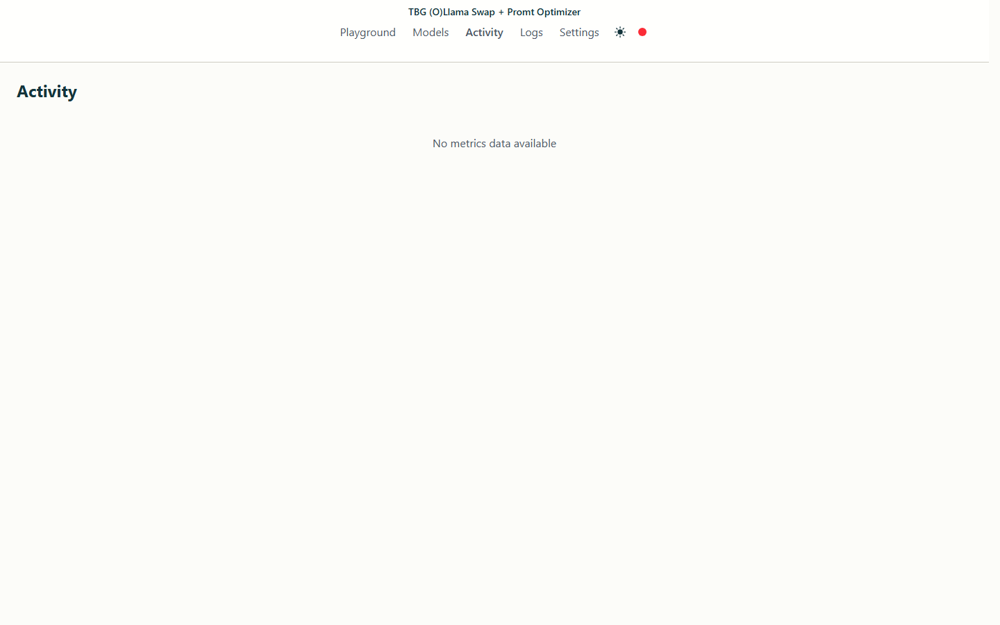
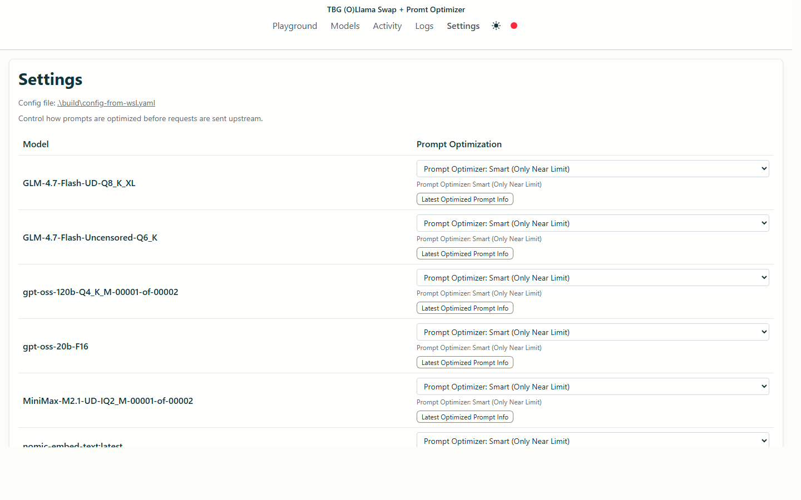
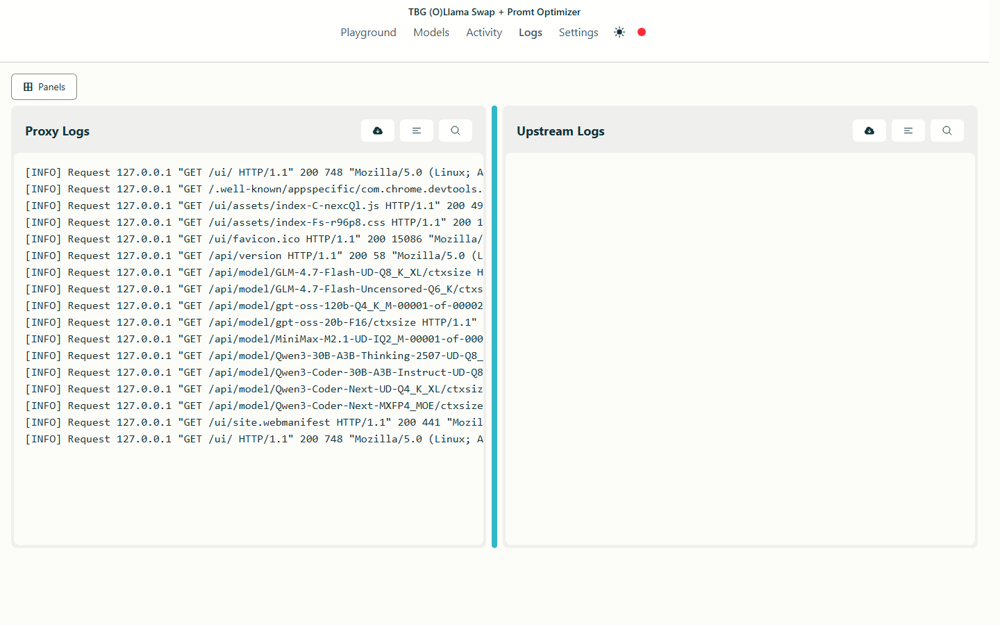

# TBG (O)Llama  Swap + Promt Optimizer

Based on Benson Wong's [llama-swap](https://github.com/mostlygeek/llama-swap).

Run multiple LLM models on your machine and hot-swap between them as needed. llama-swap works with any OpenAI API-compatible server, giving you the flexibility to switch models without restarting your applications.

Built in Go for performance and simplicity, llama-swap has zero dependencies and is incredibly easy to set up. Get started in minutes - just one binary and one configuration file.

TBG (O)Llama  Swap + Promt Optimizer extends upstream llama-swap with runtime context controls, prompt optimization policies, and a lightweight Ollama hook for mixed local-model workflows.

## Features:

- ✅ Easy to deploy and configure: one binary, one configuration file. no external dependencies
- ✅ On-demand model switching
- ✅ Use any local OpenAI compatible server (llama.cpp, vllm, tabbyAPI, stable-diffusion.cpp, etc.)
  - future proof, upgrade your inference servers at any time.
- ✅ OpenAI API supported endpoints:
  - `v1/completions`
  - `v1/chat/completions`
  - `v1/responses`
  - `v1/embeddings`
  - `v1/audio/speech` ([#36](https://github.com/mostlygeek/llama-swap/issues/36))
  - `v1/audio/transcriptions` ([docs](https://github.com/mostlygeek/llama-swap/issues/41#issuecomment-2722637867))
  - `v1/audio/voices`
  - `v1/images/generations`
  - `v1/images/edits`
- ✅ Anthropic API supported endpoints:
  - `v1/messages`
  - `v1/messages/count_tokens`
- ✅ llama-server (llama.cpp) supported endpoints
  - `v1/rerank`, `v1/reranking`, `/rerank`
  - `/infill` - for code infilling
  - `/completion` - for completion endpoint
- ✅ llama-swap API
  - `/ui` - web UI
  - `/upstream/:model_id` - direct access to upstream server ([demo](https://github.com/mostlygeek/llama-swap/pull/31))
  - `/models/unload` - manually unload running models ([#58](https://github.com/mostlygeek/llama-swap/issues/58))
  - `/running` - list currently running models ([#61](https://github.com/mostlygeek/llama-swap/issues/61))
  - `/log` - remote log monitoring
  - `/health` - just returns "OK"
- ✅ Prompt optimization controls for local agent workloads
  - `off`, `limit_only`, `always`, `llm_assisted`
  - latest optimization snapshot available via `/api/model/:model/prompt-optimization/latest`
- ✅ Runtime per-model context override for llama.cpp models via `/api/model/:model/ctxsize`
- ✅ Optional Ollama model discovery hook (when Ollama is already running)
  - auto-lists Ollama models in `/v1/models` and `/ui/models`
  - model IDs are exposed as `ollama/<model_name>`
  - Ollama entries are external/read-only in the UI (ctx shown from Modelfile when available)

## Agent CLI Context Problem

Local coding agents (for example Claude Code CLI) can produce very large and repetitive prompts across long sessions. This creates two common issues with local inference servers:

1. prompts exceed available context windows (hard failures)
2. excessive repeated transcript content reduces useful model signal per token

TBG Lama Swap + addresses this by applying optimization before forwarding to the upstream model, so the request stays inside practical context limits while preserving recent task-critical context.

## Prompt Optimization Modes

- `off`: no rewriting
- `limit_only`: optimize only when needed to stay inside configured context
- `always`: always compact repeated/low-value transcript content
- `llm_assisted`: uses the running model to summarize older middle context, then forwards compacted messages

These policies apply to llama.cpp models and to discovered Ollama models.

## Benchmarks (WSL Ubuntu, gpt-oss-20b-F16, ctx=8096)

Repeated-prompt A/B tests against the same payload:

- `always`: avg `14.164s`
- `llm_assisted`: avg `13.832s`

Quality retention test (marker recall, 2 runs each):

- `always`: `6/6` avg score, avg `5.949s`
- `llm_assisted`: `6/6` avg score, avg `5.738s`

Notes:
- both modes reduced oversized repetitive payloads to safe prompt sizes in these runs
- absolute numbers vary by model, GPU, and upstream server settings
- ✅ API Key support - define keys to restrict access to API endpoints
- ✅ Customizable
  - Run multiple models at once with `Groups` ([#107](https://github.com/mostlygeek/llama-swap/issues/107))
  - Automatic unloading of models after timeout by setting a `ttl`
  - Reliable Docker and Podman support using `cmd` and `cmdStop` together
  - Preload models on startup with `hooks` ([#235](https://github.com/mostlygeek/llama-swap/pull/235))

### Web UI

llama-swap includes a real time web interface for monitoring logs and controlling models:



The Activity Page shows recent requests:



The Settings Page exposes prompt optimization and model controls:



The Logs Page gives live proxy and upstream log visibility:



## Install and Build

### Prerequisites

- Go (1.24+ recommended)
- Node.js + npm (for UI build)
- Optional: CUDA-enabled llama.cpp and/or Ollama runtime

### Build From Source

```shell
git clone https://github.com/Ltamann/tbg-ollama-swap-prompt-optimizer.git
cd tbg-ollama-swap-prompt-optimizer
make clean all
```

Output binaries are created in `build/`.

### Run

```shell
# example
./build/llama-swap -config ./config.yaml -listen 0.0.0.0:8080
```

On Windows:

```powershell
.\build\llama-swap-windows-amd64.exe -config .\config.yaml -listen 127.0.0.1:8080
```

## Configuration

```yaml
# full sample config.yaml for TBG (O)Llama Swap + Promt Optimizer

healthCheckTimeout: 120
startPort: 10001
logLevel: info
includeAliasesInList: true

# optional API protection
apiKeys:
  - ${env.LLAMASWAP_API_KEY}

# default behavior for prompt-truncation fallback
sendLoadingState: true

# reusable key/value variables
macros:
  LLAMA_BIN: /home/admmin/llama/cuda/llama.cpp/build/bin/llama-server
  MODEL_DIR: /home/admmin/models
  HOST: 0.0.0.0
  THREADS: 16
  GPU_LAYERS: 999

hooks:
  on_startup:
    preload:
      - Qwen3-Coder-Next-MXFP4_MOE

models:
  Qwen3-Coder-Next-MXFP4_MOE:
    name: "Qwen3-Coder-Next"
    description: "Primary coding model"
    cmd: >
      ${LLAMA_BIN}
      --model ${MODEL_DIR}/Qwen3-Coder-Next-MXFP4_MOE.gguf
      --host ${HOST} --port ${PORT}
      --threads ${THREADS}
      --threads-batch 48
      --n-gpu-layers ${GPU_LAYERS}
      --n-cpu-moe 0
      --ctx-size 202752
      --batch-size 4096
      --ubatch-size 512
      --tensor-split 60,40
      --flash-attn on
      --jinja
      --parallel 1
    checkEndpoint: /health
    ttl: 0
    aliases:
      - claude-sonnet-4-5
      - tbg-coder-next
      - qwen3-coder-next
    useModelName: Qwen3-Coder-Next-MXFP4_MOE
    truncationMode: sliding_window
    filters:
      # remove client params you want server-side defaults for
      stripParams: "temperature,top_p,top_k,repeat_penalty"
      # force stable server-side params
      setParams:
        temperature: 0.7
        top_p: 0.95
        top_k: 40
        min_p: 0.01
    metadata:
      family: qwen3-coder-next
      quant: mxfp4
      vram_hint_gb: 24

  gpt-oss-20b-F16:
    name: "gpt-oss-20b"
    description: "Secondary reasoning/coding model"
    cmd: >
      ${LLAMA_BIN}
      --model ${MODEL_DIR}/gpt-oss-20b-F16.gguf
      --host ${HOST} --port ${PORT}
      --threads ${THREADS}
      --n-gpu-layers ${GPU_LAYERS}
      --ctx-size 262144
      --batch-size 2048
      --ubatch-size 512
      --flash-attn on
      --jinja
      --parallel 1
    checkEndpoint: /health
    ttl: 1800
    aliases:
      - gpt-oss
      - gpt-oss-20b
    truncationMode: strict_error

groups:
  coding:
    swap: true
    exclusive: true
    persistent: false
    members:
      - Qwen3-Coder-Next-MXFP4_MOE
      - gpt-oss-20b-F16
```

Notes for this fork:

1. `ctx-size` is controlled at runtime from the UI/API (`/api/model/:model/ctxsize`) and can override model runtime context behavior without editing `config.yaml`.
2. Prompt optimization policy is runtime-configurable per model from Settings (`off`, `limit_only`, `always`, `llm_assisted`).
3. Ollama models are auto-discovered when Ollama is reachable; they do not need `models:` entries in `config.yaml`.

See the [configuration documentation](docs/configuration.md) for all options.

## How does llama-swap work?

When a request is made to an OpenAI compatible endpoint, llama-swap will extract the `model` value and load the appropriate server configuration to serve it. If the wrong upstream server is running, it will be replaced with the correct one. This is where the "swap" part comes in. The upstream server is automatically swapped to handle the request correctly.

In the most basic configuration llama-swap handles one model at a time. For more advanced use cases, the `groups` feature allows multiple models to be loaded at the same time. You have complete control over how your system resources are used.

## Reverse Proxy Configuration (nginx)

If you deploy llama-swap behind nginx, disable response buffering for streaming endpoints. By default, nginx buffers responses which breaks Server‑Sent Events (SSE) and streaming chat completion. ([#236](https://github.com/mostlygeek/llama-swap/issues/236))

Recommended nginx configuration snippets:

```nginx
# SSE for UI events/logs
location /api/events {
    proxy_pass http://your-llama-swap-backend;
    proxy_buffering off;
    proxy_cache off;
}

# Streaming chat completions (stream=true)
location /v1/chat/completions {
    proxy_pass http://your-llama-swap-backend;
    proxy_buffering off;
    proxy_cache off;
}
```

As a safeguard, llama-swap also sets `X-Accel-Buffering: no` on SSE responses. However, explicitly disabling `proxy_buffering` at your reverse proxy is still recommended for reliable streaming behavior.

## Monitoring Logs on the CLI

```sh
# sends up to the last 10KB of logs
$ curl http://host/logs

# streams combined logs
curl -Ns http://host/logs/stream

# stream llama-swap's proxy status logs
curl -Ns http://host/logs/stream/proxy

# stream logs from upstream processes that llama-swap loads
curl -Ns http://host/logs/stream/upstream

# stream logs only from a specific model
curl -Ns http://host/logs/stream/{model_id}

# stream and filter logs with linux pipes
curl -Ns http://host/logs/stream | grep 'eval time'

# appending ?no-history will disable sending buffered history first
curl -Ns 'http://host/logs/stream?no-history'
```

## Do I need to use llama.cpp's server (llama-server)?

Any OpenAI compatible server would work. llama-swap was originally designed for llama-server and it is the best supported.

For Python based inference servers like vllm or tabbyAPI it is recommended to run them via podman or docker. This provides clean environment isolation as well as responding correctly to `SIGTERM` signals for proper shutdown.

## Star History

> [!NOTE]
> ⭐️ Star this project to help others discover it!

[](https://www.star-history.com/#mostlygeek/llama-swap&Date)
