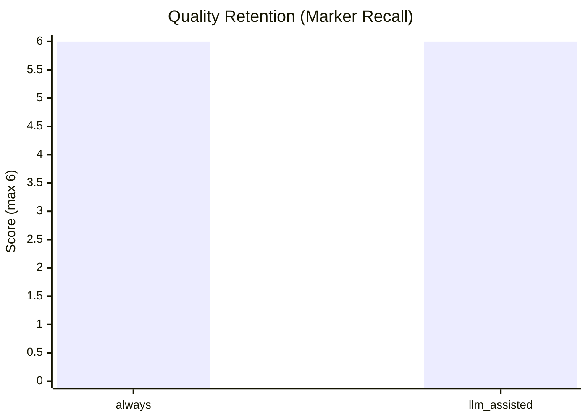

# TBG (O)Llama Swap + Promt Optimizer

Based on Benson Wong's [llama-swap](https://github.com/mostlygeek/llama-swap).

This fork targets local agent workflows (for example Claude Code CLI) where prompts become very long and repetitive. It adds runtime context control, prompt optimization policies, and an Ollama passthrough hook on top of upstream llama-swap.

## What This Repo Solves

Long local-agent sessions often create:

- prompt payloads that exceed model context limits
- repeated transcript blocks that waste context budget

TBG (O)Llama Swap + Promt Optimizer can compact prompts before forwarding to the model, helping keep requests inside practical context limits.

## Key Features

- Model hot-swap via one OpenAI-compatible endpoint
- Runtime context override per model (`/api/model/:model/ctxsize`)
- Prompt optimization policies per model:
  - `off`
  - `limit_only`
  - `always`
  - `llm_assisted`
- Latest optimization snapshot API:
  - `/api/model/:model/prompt-optimization/latest`
- Optional Ollama hook (if Ollama is already running):
  - auto-discovers models in `/v1/models` and `/ui/models`
  - exposes IDs as `ollama/<model_name>`
  - keeps Ollama ctx read-only in UI/API

## How llama-swap Works In This Fork

Request flow:

`Client (Claude Code/OpenWebUI) -> TBG (O)Llama Swap + Promt Optimizer -> llama.cpp or Ollama`

1. Client sends request with a `model` ID.
2. Proxy resolves whether it is a configured llama.cpp model or an `ollama/*` model.
3. For configured models, proxy ensures the correct upstream process is active (swap if needed).
4. Prompt optimization policy is applied according to model settings.
5. Request is forwarded to the active upstream and streamed back to client.

## Prompt Optimization Benchmarks

Test setup:

- Environment: WSL Ubuntu
- Model: `gpt-oss-20b-F16`
- Context: `8096`
- Compared policies: `always` vs `llm_assisted`

### Results Table

| Metric | always | llm_assisted |
|---|---:|---:|
| Avg latency (repeated prompt A/B) | 14.164s | 13.832s |
| Quality score (marker recall, avg) | 6.0/6 | 6.0/6 |
| Avg latency (quality test runs) | 5.949s | 5.738s |


### Speed Graph (lower is better)

```mermaid
xychart-beta
    title "Prompt Optimization Speed Comparison"
    x-axis ["A/B Avg", "Quality Avg"]
    y-axis "Seconds" 0 --> 16
    bar [14.164, 5.949]
    bar [13.832, 5.738]
```



Legend:
- Bar 1: `always`
- Bar 2: `llm_assisted`

### Quality Graph (higher is better)



## UI


## Build

### Prerequisites

- Go 1.24+
- Node.js + npm (for UI build)
- Optional: llama.cpp and/or Ollama runtime

### Build from source

```bash
git clone https://github.com/Ltamann/tbg-ollama-swap-prompt-optimizer.git
cd tbg-ollama-swap-prompt-optimizer
make clean all
```

Binaries are generated in `build/`.

## Run

```bash
./build/llama-swap -config ./config.yaml -listen 0.0.0.0:8080
```

Windows:

```powershell
.\build\llama-swap-windows-amd64.exe -config .\config.yaml -listen 127.0.0.1:8080
```

## Configuration (Full Model Sample)

```yaml
healthCheckTimeout: 120
startPort: 10001
logLevel: info
includeAliasesInList: true
sendLoadingState: true

apiKeys:
  - ${env.LLAMASWAP_API_KEY}

macros:
  LLAMA_BIN: /home/admin/llama/cuda/llama.cpp/build/bin/llama-server
  MODEL_DIR: /home/admin/models
  HOST: 0.0.0.0
  THREADS: 16
  GPU_LAYERS: 999

models:
  Qwen3-Coder-Next-MXFP4_MOE:
    name: "Qwen3-Coder-Next"
    description: "Primary coding model"
    cmd: >
      ${LLAMA_BIN}
      --model ${MODEL_DIR}/Qwen3-Coder-Next-MXFP4_MOE.gguf
      --host ${HOST} --port ${PORT}
      --threads ${THREADS}
      --n-gpu-layers ${GPU_LAYERS}
      --ctx-size 32768
      --flash-attn on
      --jinja
      --parallel 1
    checkEndpoint: /health
    aliases:
      - tbg-coder-next
      - qwen3-coder-next
    useModelName: Qwen3-Coder-Next-MXFP4_MOE
    truncationMode: sliding_window
    filters:
      stripParams: "temperature,top_p,top_k,repeat_penalty"
      setParams:
        temperature: 0.7
        top_p: 0.95
        top_k: 40
        min_p: 0.01
    metadata:
      family: qwen3-coder-next
      quant: mxfp4
      vram_hint_gb: 24

  gpt-oss-20b-F16:
    name: "gpt-oss-20b"
    description: "Secondary reasoning/coding model"
    cmd: >
      ${LLAMA_BIN}
      --model ${MODEL_DIR}/gpt-oss-20b-F16.gguf
      --host ${HOST} --port ${PORT}
      --threads ${THREADS}
      --n-gpu-layers ${GPU_LAYERS}
      --ctx-size 8192
      --flash-attn on
      --jinja
      --parallel 1
    checkEndpoint: /health
    aliases:
      - gpt-oss
      - gpt-oss-20b
    truncationMode: strict_error

groups:
  coding:
    swap: true
    exclusive: true
    persistent: false
    members:
      - Qwen3-Coder-Next-MXFP4_MOE
      - gpt-oss-20b-F16
```

## Runtime Controls

- Context size can be changed at runtime from UI Models page and via `/api/model/:model/ctxsize`.
- Prompt optimization policy can be changed in Settings and via `/api/model/:model/prompt-optimization`.
- Ollama models do not require `models:` entries; they appear automatically when Ollama is reachable.

## Notes

- This repo focuses on local-model stability for CLI agents that produce repetitive long prompts.
- See `docs/configuration.md` for complete upstream-compatible config options.


