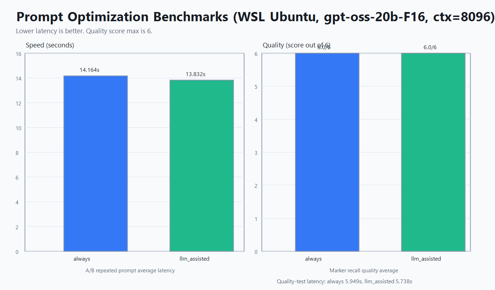

# TBG (O)llama Swap + Prompt Optimizer

Based on Benson Wong's upstream project: [mostlygeek/llama-swap](https://github.com/mostlygeek/llama-swap).

TBG (O)llama Swap + Prompt Optimizer is focused on local agent workflows (for example Claude Code CLI) where prompts become very large, repetitive, and unstable for low-VRAM local inference.

## What This Fork Adds

- Runtime per-model context override from UI/API
- Prompt optimization policies per model
- Latest optimization snapshot endpoint for audit/debug
- Optional Ollama discovery and passthrough hook
- Unified model list for configured llama.cpp models and live Ollama models

## Why This Exists

Long local coding-agent sessions can produce:

- repeated transcript blocks
- context overflow errors
- wasted context budget on low-value history

TBG (O)llama Swap optimizes request payloads before forwarding upstream so context is used for relevant content.

## How TBG (O)llama Swap Works

Request path:

`Client (Claude Code / OpenWebUI) -> TBG (O)llama Swap + Prompt Optimizer -> llama.cpp or Ollama`

Detailed behavior:

1. Client calls an OpenAI-compatible endpoint with a `model`.
2. The proxy resolves the target model source:
- configured model in `config.yaml`
- discovered live model with ID `ollama/<name>`
3. If needed, the proxy swaps upstream process state to match the requested configured model.
4. Runtime model settings are applied:
- context override (`/api/model/:model/ctxsize`)
- prompt optimization policy (`/api/model/:model/prompt-optimization`)
5. Prompt payload is optionally compacted based on policy:
- `off` (no optimization)
- `limit_only` (optimize only near/over limit)
- `always` (aggressive optimization)
- `llm_assisted` (smart optimization using model-assisted summarization)
6. Request is forwarded and response is streamed back to client.
7. Latest optimization result can be inspected via:
- `/api/model/:model/prompt-optimization/latest`

## Prompt Optimization Benchmarks

Test environment:

- WSL Ubuntu
- model: `gpt-oss-20b-F16`
- context: `8096`
- payload: huge repetitive coding-session transcript

Mode naming used in this README:

- `off` = optimization disabled
- `smart` = internal policy `limit_only`
- `aggressive` = internal policy `always`
- `llm_assisted` = model-assisted summarization mode (separate from smart)

### Latest Same-Payload Test (smart vs aggressive)

| Mode | prompt_tokens | completion_tokens | total_tokens | latency |
|---|---:|---:|---:|---:|
| smart (`limit_only`) | 83 | 32 | 115 | ~2415 ms |
| aggressive (`always`) | 108 | 32 | 140 | ~2323 ms |

Interpretation:

- both modes stayed inside context and completed successfully.
- in this test, smart produced fewer prompt tokens than aggressive.
- aggressive is not guaranteed to be smaller on every prompt; outcomes depend on repetition shape and downstream tokenization.

### Historical Project Runs (aggressive vs llm_assisted)

| Metric | aggressive (`always`) | llm_assisted |
|---|---:|---:|
| Avg latency (repeated prompt A/B) | 14.164s | 13.832s |
| Avg latency (quality test runs) | 5.949s | 5.738s |
| Quality score (marker recall, avg) | 6.0/6 | 6.0/6 |

### Off Baseline Status

- off vs aggressive baseline values were tested earlier but numeric logs are not currently retained in-repo.



### 200k Coding Looseness Factor (Practical Rule)

- `off`: 0% intentional loss, highest fidelity, highest overflow risk.
- `smart` (`limit_only`): typically ~1-5% semantic loss risk on real coding threads.
- `aggressive` (`always`): typically ~5-15% semantic/detail loss risk.

Recommended looseness factor for coding at 200k:

- smart: `1.05`
- aggressive: `1.15`

Operational guidance:

- default to smart (`limit_only`) for long coding sessions.
- use aggressive (`always`) only when repetitive bloat still pushes context pressure.
- keep critical constraints in the latest system/user message so they survive compaction.

## UI


## Build

### Prerequisites

- Go 1.24+
- Node.js + npm (for UI build)
- Optional: llama.cpp and/or Ollama runtime

### Build from source

```bash
git clone https://github.com/Ltamann/tbg-ollama-swap-prompt-optimizer.git
cd tbg-ollama-swap-prompt-optimizer
make clean all
```

Binaries are generated in `build/`.

## Run

```bash
./build/llama-swap -config ./config.yaml -listen 0.0.0.0:8080
```

Windows:

```powershell
.\build\llama-swap-windows-amd64.exe -config .\config.yaml -listen 127.0.0.1:8080
```

## Configuration (Full Model Sample)

```yaml
healthCheckTimeout: 120
startPort: 10001
logLevel: info
includeAliasesInList: true
sendLoadingState: true

apiKeys:
  - ${env.LLAMASWAP_API_KEY}

macros:
  LLAMA_BIN: /home/admin/llama/cuda/llama.cpp/build/bin/llama-server
  MODEL_DIR: /home/admin/models
  HOST: 0.0.0.0
  THREADS: 16
  GPU_LAYERS: 999

hooks:
  on_startup:
    preload:
      - Qwen3-Coder-Next-MXFP4_MOE

models:
  Qwen3-Coder-Next-MXFP4_MOE:
    name: "Qwen3-Coder-Next"
    description: "Primary coding model"
    cmd: >
      ${LLAMA_BIN}
      --model ${MODEL_DIR}/Qwen3-Coder-Next-MXFP4_MOE.gguf
      --host ${HOST} --port ${PORT}
      --threads ${THREADS}
      --threads-batch 48
      --n-gpu-layers ${GPU_LAYERS}
      --n-cpu-moe 0
      --ctx-size 202752
      --batch-size 4096
      --ubatch-size 512
      --tensor-split 60,40
      --flash-attn on
      --jinja
      --parallel 1
    checkEndpoint: /health
    ttl: 0
    aliases:
      - tbg-coder-next
      - qwen3-coder-next
    useModelName: Qwen3-Coder-Next-MXFP4_MOE
    truncationMode: sliding_window
    filters:
      stripParams: "temperature,top_p,top_k,repeat_penalty"
      setParams:
        temperature: 0.7
        top_p: 0.95
        top_k: 40
        min_p: 0.01
    metadata:
      family: qwen3-coder-next
      quant: mxfp4
      vram_hint_gb: 24

  gpt-oss-20b-F16:
    name: "gpt-oss-20b"
    description: "Secondary reasoning/coding model"
    cmd: >
      ${LLAMA_BIN}
      --model ${MODEL_DIR}/gpt-oss-20b-F16.gguf
      --host ${HOST} --port ${PORT}
      --threads ${THREADS}
      --n-gpu-layers ${GPU_LAYERS}
      --ctx-size 262144
      --batch-size 2048
      --ubatch-size 512
      --flash-attn on
      --jinja
      --parallel 1
    checkEndpoint: /health
    ttl: 1800
    aliases:
      - gpt-oss
      - gpt-oss-20b
    truncationMode: strict_error

groups:
  coding:
    swap: true
    exclusive: true
    persistent: false
    members:
      - Qwen3-Coder-Next-MXFP4_MOE
      - gpt-oss-20b-F16
```

Runtime notes:

- Context can be overridden at runtime in UI and API (`/api/model/:model/ctxsize`).
- Prompt optimization policy is runtime-configurable per model.
- Ollama models are auto-discovered when Ollama is reachable and are shown as external/read-only for ctx override.

## API Surface Added By This Fork

- `POST /api/model/:model/ctxsize`
- `GET /api/model/:model/ctxsize`
- `POST /api/model/:model/prompt-optimization`
- `GET /api/model/:model/prompt-optimization`
- `GET /api/model/:model/prompt-optimization/latest`

## Notes

- This project focuses on practical local-model reliability for CLI agents with long repetitive prompts.
- For full base configuration options, see `docs/configuration.md`.

